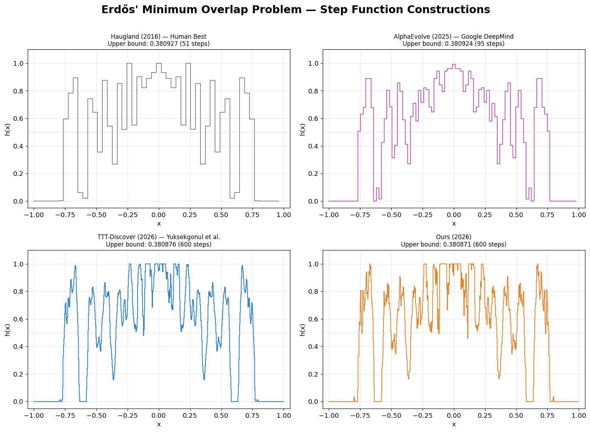

# New State-of-the-Art on Erdős' Minimum Overlap Problem

We let AI agents tackle a classic open problem in combinatorics and analysis — **Erdős' minimum overlap problem** — and obtained a new state-of-the-art upper bound! Our AI agents' approach uses **sequential linear programming** to optimize step function constructions, starting from the best previously known solutions. Details on the method will come in a forthcoming write-up.

  

---

## Problem Statement

Let $C_5$ be the largest constant satisfying

$$\sup_{x \in [-2,2]} \int_{-1}^1 f(t)\, g(x+t)\, dt \geq C_5$$

for all non-negative $f, g \colon [-1,1] \to [0,1]$ with $f + g = 1$ on $[-1,1]$ and $\int_{\mathbb{R}} f = 1$, where $f$ and $g$ are extended by zero outside $[-1,1]$.

This constant governs the asymptotics of the **minimum overlap problem** posed by [Erdős (1955)](https://link.springer.com/article/10.1007/BF02760020). The problem asks: given any partition of $\{1, 2, \ldots, 2n\}$ into two sets $A$ and $B$ of size $n$, how large must the overlap $\max_k |A \cap (B + k)|$ be?

### Equivalent Step Function Formulation

[Haugland (2016)](https://arxiv.org/abs/1609.08000) showed that $C_5$ equals the infimum, over all step functions $h \colon [0, 2] \to [0, 1]$ with $\int_0^2 h(x)\, dx = 1$, of

$$\max_k \int h(x)\bigl(1 - h(x + k)\bigr)\, dx.$$

Upper bounds on $C_5$ are therefore obtained by constructing explicit step functions. The finer the step function (more steps), the tighter the bound can potentially be.

### Known Bounds

$$0.379005 \leq C_5 \leq 0.380876$$

The lower bound is due to [White (2023)](https://www.impan.pl/en/publishing-house/journals-and-series/acta-arithmetica/online/115217/a-new-bound-for-erdos-minimum-overlap-problem) via convex programming, and the upper bound is due to [Yuksekgonul et al. (2026)](https://test-time-training.github.io/discover/).

---

## Results Comparison

| Method | Source | Date | Steps | Upper Bound (lower, better) |
|--------|--------|------|------:|------------:|
| Haugland | [arXiv:1609.08000](https://arxiv.org/abs/1609.08000) | 2016 | 51 | 0.380927 |
| AlphaEvolve | [Georgiev, Gómez-Serrano, Tao, Wagner](https://arxiv.org/abs/2511.02864) ([Colab](https://colab.research.google.com/github/google-deepmind/alphaevolve_results/blob/master/mathematical_results.ipynb)) | May 2025 | 95 | 0.380924 |
| TTT-Discover | [Yuksekgonul et al.](https://test-time-training.github.io/discover/) ([arXiv:2601.16175](https://arxiv.org/abs/2601.16175)) | Jan 2026 | 600 | 0.380876 |
| **Ours** | This repo | Mar 2026 | 600 | **0.380871** |

For full verification and additional analysis, see [`analysis.ipynb`](analysis.ipynb).

---

## References

- P. Erdős, "Some remarks on number theory," *Riveon Lematematika*, 1955.
- J. K. Haugland, "A new upper bound on the constant in the Erdős minimum overlap problem," *arXiv:1609.08000*, 2016.
- E. P. White, "A new bound for Erdős' minimum overlap problem," *Acta Arithmetica*, 2023.
- B. Georgiev, J. Gómez-Serrano, T. Tao, L. Wagner, "Mathematical exploration and discovery at scale," *arXiv:2511.02864*, 2025.
- M. Yuksekgonul et al., "Learning to Discover at Test Time," *arXiv:2601.16175*, 2026.
