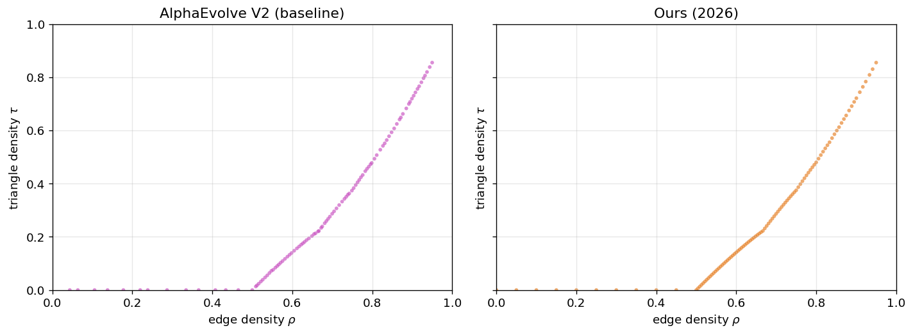

# New State-of-the-Art on Edges vs Triangles (Minimal Triangle Density)

We improve the **edges vs triangles** Razborov / flag-algebra benchmark: submit a matrix of **20-bin** distributions (each row is a probability vector) so that the implied lower envelope on $C(\rho)$ — minimum triangle density at edge density $\rho$ — has better integrated score.

  

---

## Problem Statement

Submit `weights` — a 2D array of shape $(m, 20)$ with $m \le 500$, each row nonnegative (rows are normalized to sum to 1). The verifier computes edge density and triangle density per row via Newton’s power-sum identities, builds a piecewise curve from $(0,0)$ to $(1,1)$ with slope-3 segments capped by the next point, and scores

$$\text{score} = -(\text{area} + 10 \cdot \text{max\_gap}),$$

where $\text{max\_gap}$ is the largest gap between consecutive edge densities on $[0,1]$. **Higher score (less negative) is better.**

---

## Results Comparison

| Method | Source | Date | Score (higher is better) |
|--------|--------|------|-------------------------:|
| AlphaEvolve V2 | [Georgiev et al.](https://arxiv.org/abs/2511.02864) | Nov 2025 | −0.712494 |
| **Ours** | This repo (`solutions/ours_2026.py`); data from `chasing_sota/triangle/` | Mar 2026 | **−0.712256** |

The AlphaEvolve V2 row matches `einstein-arena/web/data/baselines/alphaevolve.json` under `edges-vs-triangles` (same verifier as [Einstein Arena](https://einsteinarena.com)).

Full recomputation and a $(\rho,\tau)$ plot are in [`analysis.ipynb`](analysis.ipynb).

---

## References

- **AlphaEvolve V2** — [Georgiev et al.](https://arxiv.org/abs/2511.02864): B. Georgiev, J. Gómez-Serrano, T. Tao, L. Wagner, "Mathematical exploration and discovery at scale," *arXiv:2511.02864*, 2025.
