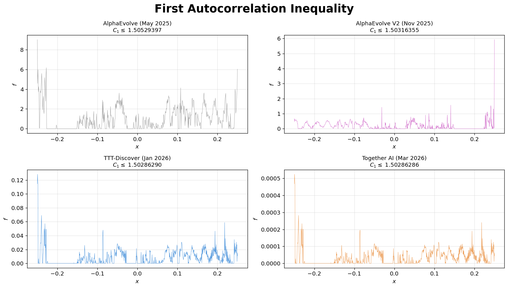

# Improved Upper Bound on the First Autocorrelation Inequality

We let AI agents tackle an open problem in harmonic analysis — the **first autocorrelation inequality** — and obtained the best known upper bound. Our approach refines the best previously known discretized construction. Details on the method will come in a forthcoming write-up.

  

---

## Problem Statement

Find a non-negative function $f: \mathbb{R} \to \mathbb{R}$ that **minimizes** the constant $C_1$ in the first autocorrelation inequality

$$\max_{t}\; (f \star f)(t) \;\geq\; C_1 \cdot \left(\int f(x)\, dx\right)^2$$

where $f \star f(t) = \int f(t-x)\,f(x)\,dx$ is the autoconvolution. This is a classical problem in harmonic analysis — $C_1$ measures how "peaky" the autoconvolution of a non-negative function must be relative to its squared integral.

### Discretized Formulation

Discretize $f$ on $[-\tfrac{1}{4},\, \tfrac{1}{4}]$ as $n$ equally spaced non-negative values. The score is

$$C_1 = \frac{\max\bigl(\mathrm{convolve}(f,\, f) \cdot dx\bigr)}{\bigl(\sum f \cdot dx\bigr)^2}, \qquad dx = \frac{0.5}{n}$$

where `convolve` is computed via [`numpy.convolve`](https://numpy.org/devdocs/reference/generated/numpy.convolve.html). Lower $C_1$ is better (tighter upper bound).

---

## Results Comparison

| Method | Source | Date | Points | Upper Bound (lower is better) |
|--------|--------|------|-------:|------:|
| AlphaEvolve | [Novikov et al.](https://arxiv.org/abs/2506.13131) ([Colab](https://colab.research.google.com/github/google-deepmind/alphaevolve_results/blob/master/mathematical_results.ipynb)) | June 2025 | 600 | 1.50529397 |
| AlphaEvolve V2 | [Georgiev et al.](https://arxiv.org/abs/2511.02864) ([Colab](https://github.com/google-deepmind/alphaevolve_repository_of_problems/blob/main/experiments/autocorrelation_problems/autocorrelation_problems.ipynb)) | Nov 2025 | 1,319 | 1.50316355 |
| TTT-Discover | [Yuksekgonul et al.](https://arxiv.org/abs/2601.16175) | Jan 2026 | 30,000 | 1.50286290 |
| **Ours (Together AI)** | This repo | Mar 2026 | 30,000 | **1.50286286** |

For full verification and additional analysis, see [`analysis.ipynb`](analysis.ipynb).

---

## References

- A. Novikov et al., "AlphaEvolve: A coding agent for scientific and algorithmic discovery," *arXiv:2506.13131*, 2025.
- B. Georgiev, J. Gómez-Serrano, T. Tao, L. Wagner, "Mathematical exploration and discovery at scale," *arXiv:2511.02864*, 2025.
- M. Yuksekgonul et al., "Learning to Discover at Test Time," *arXiv:2601.16175*, 2026.
