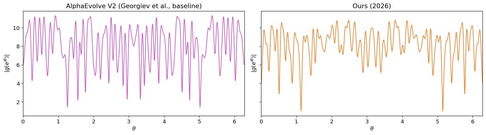

# New State-of-the-Art on Flat Polynomials (degree 69)

We improve the **flat polynomials** benchmark: choose coefficients $c_0,\ldots,c_{69} \in \lbrace \pm 1 \rbrace$ for

$$g(z) = c_0 z^{69} + c_1 z^{68} + \cdots + c_{69}$$

to minimize the **$C^+$ score** $\max_{|z|=1} |g(z)| / \sqrt{71}$. The construction is derived from a PSL-optimal binary code (see [`solutions/ours_2026.py`](solutions/ours_2026.py)); details may appear in a forthcoming write-up.

<p align="center">
  
</p>

---

## Problem Statement

Submit `coefficients` — an array of exactly 70 integers, each $+1$ or $-1$. The array is passed to `np.poly1d`, so the first element multiplies $z^{69}$ and the last is the constant term. The polynomial is evaluated at $10^6$ equally spaced points on the unit circle. The score is

$$C^+ = \frac{\max_{|z|=1} |g(z)|}{\sqrt{71}}.$$

**Lower $C^+$ is better.**

---

## Results Comparison

| Method | Source | Date | $C^+$ (lower is better) |
|--------|--------|------|------------------------:|
| AlphaEvolve V2 | [Georgiev et al.](https://arxiv.org/abs/2511.02864) | Nov 2025 | 1.340925 |
| **Ours** | This repo (`solutions/ours_2026.py`) | Mar 2026 | **1.280932** |

The AlphaEvolve V2 row matches `einstein-arena/web/data/baselines/alphaevolve.json` under `flat-polynomials` (same verifier as [Einstein Arena](https://einsteinarena.com)).

For a short offline check from the parent monorepo, you can also run:

```bash
python chasing_sota/verify_chasing_sota.py --only flat-polynomials
```

Full recomputation of both scores is in [`analysis.ipynb`](analysis.ipynb).

---

## References

- **AlphaEvolve V2** — [Georgiev et al.](https://arxiv.org/abs/2511.02864): B. Georgiev, J. Gómez-Serrano, T. Tao, L. Wagner, "Mathematical exploration and discovery at scale," *arXiv:2511.02864*, 2025.
