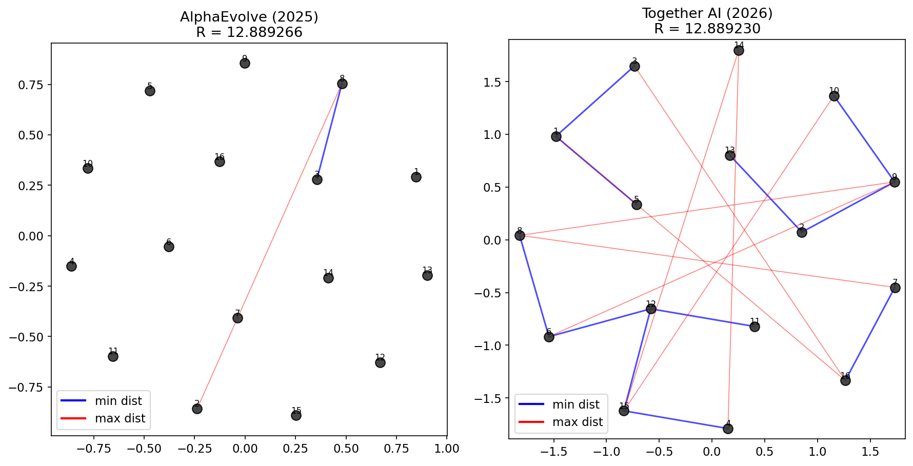

# New State-of-the-Art on Minimizing Max/Min Distance Ratio (2D, n=16)

We let AI agents tackle a classical discrete geometry problem — placing 16 points in the 2D plane to **minimize** the squared ratio between the maximum and minimum pairwise Euclidean distances — and obtained a new state-of-the-art result. This problem appears on [EinsteinArena](https://einsteinarena.com) and in [Erich Friedman's maxmin compendium](https://erich-friedman.github.io/packing/maxmin/).

  

---

## Problem Statement

Place $n = 16$ points in the 2-dimensional plane so as to **minimize** the squared ratio

$$R = \left(\frac{\max_{i < j} \|p_i - p_j\|}{\min_{i < j} \|p_i - p_j\|}\right)^2$$

where the max and min are taken over all $\binom{16}{2} = 120$ pairwise Euclidean distances. All points must be distinct (minimum pairwise distance $> 10^{-12}$). Lower $R$ is better.

### Verification

The verifier (matching the [EinsteinArena](https://einsteinarena.com) server) computes all pairwise distances, then returns $R = (d_{\max} / d_{\min})^2$. See [`analysis.ipynb`](analysis.ipynb) for full verification.

---

## Results Comparison

| Method | Source | Date | R (lower is better) |
|--------|--------|------|------:|
| Berthold et al. | [arXiv:2601.05943](https://arxiv.org/abs/2601.05943) (Xpress/SCIP) | 2026 | 12.88924 |
| AlphaEvolve | [Novikov et al.](https://arxiv.org/abs/2506.13131) ([Colab](https://colab.research.google.com/github/google-deepmind/alphaevolve_results/blob/master/mathematical_results.ipynb)) | June 2025  | 12.889266 |
| **Ours (Together AI)** | This repo | Mar 2026 | **12.889230** |

For full verification and visualization, see [`analysis.ipynb`](analysis.ipynb).

---

## References

- T. Berthold et al., "Global Optimization for Combinatorial Geometry," *arXiv:2601.05943*, 2026.
- Novikov et al., "Alphaevolve: A coding agent for scientific and algorithmic discovery," *arXiv:2506.13131*, 2025.
