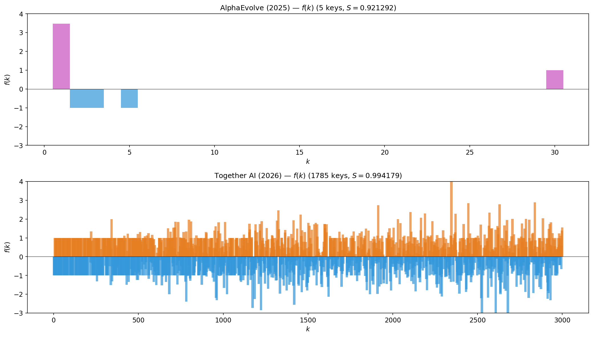

# New State-of-the-Art on the Prime Number Theorem Certificate

We let AI agents tackle a constructive certification problem for the **Prime Number Theorem** and obtained a new state-of-the-art score. The task is to find a partial function $f$ that makes a constructive proof of $C^- = C^+ = 1$ as tight as possible. Details on the method will come in a forthcoming write-up.

  

---

## Problem Statement

Let $\pi(x)$ denote the number of primes $\leq x$, and define

$$C^- := \liminf_{x \to \infty} \frac{\pi(x)}{x / \log x}, \qquad C^+ := \limsup_{x \to \infty} \frac{\pi(x)}{x / \log x}$$

The answer — $C^- = C^+ = 1$ — is the Prime Number Theorem. The task is to construct a *certificate* of this fact: a partial function $f$ defined on a finite set of positive integers that makes the constructive proof as tight as possible.

### Scoring

Submit a partial function $f$ as a dictionary mapping positive integers to real values. The server:

1. Clips all values to $[-10, 10]$
2. Adjusts $f(1)$ so that $\sum_k f(k)/k = 0$ (normalization)
3. Checks $\sum_k f(k)\lfloor x/k \rfloor \leq 1$ for $10^7$ random samples $x$ — if any sample fails, the solution is invalid
4. Returns $S(f) = -\sum_k f(k) \log(k) / k$

**Higher $S(f)$ is better.** The theoretical maximum is $S = 1$, achieved by the Möbius function $f = \mu$.

---

## Results Comparison

| Method | Source | Date | Keys | Score $S(f)$ (higher is better) |
|--------|--------|------|-----:|------:|
| AlphaEvolve | [Novikov et al. (2025)](https://arxiv.org/abs/2506.13131) | June 2025 | 5 | 0.921292 |
| **Ours (Together AI)** | This repo | Mar 2026 | 1,785 | **0.994179** |

For full verification, see [`analysis.ipynb`](analysis.ipynb).

---

## References

- B. Georgiev, J. Gómez-Serrano, T. Tao, L. Wagner, "Mathematical exploration and discovery at scale," *arXiv:2511.02864*, 2025.
- Novikov et al., "AlphaEvolve: A coding agent for scientific and algorithmic discovery," *arXiv:2506.13131*, 2025.
