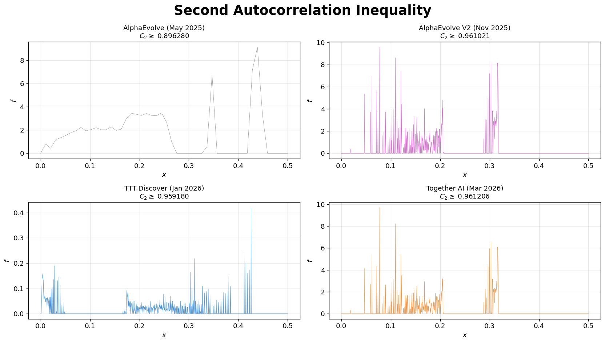

# Improved Lower Bound on the Second Autocorrelation Inequality

We let AI agents tackle an open problem in harmonic analysis — the **second autocorrelation inequality** — and obtained the best **publicly available** lower bound. Our approach uses **projected gradient ascent** to optimize a 100,000-point discretized function, starting from the best previously known solution.

> **Note:** [ImprovEvolve](https://arxiv.org/abs/2602.10233) (Kravatskiy et al., Feb 2026) reports a higher bound of 0.96258, but the explicit solution is not publicly available. Our solution (0.961206) is the best with reproducible, publicly released data.

  

---

## Problem Statement

Find a non-negative function $f: \mathbb{R} \to \mathbb{R}$ that **maximizes** the constant $C_2$ in the second autocorrelation inequality

$$\|f \star f\|_2^2 \;\leq\; C_2 \;\|f \star f\|_1 \;\|f \star f\|_\infty$$

where $f \star f(t) = \int f(t-x)\,f(x)\,dx$ is the autoconvolution. By Hölder's inequality, $C_2 \leq 1$ trivially; the question is how close to $1$ the ratio can be when $F = f \star f$ is constrained to be an autoconvolution.

### Discretized Formulation

Discretize $f$ as $n$ non-negative values. The autoconvolution $f \star f$ is computed via [`numpy.convolve`](https://numpy.org/devdocs/reference/generated/numpy.convolve.html). The score is

$$C_2 = \frac{\|f \star f\|_2^2}{\|f \star f\|_1 \cdot \|f \star f\|_\infty}$$

using piecewise-linear (trapezoidal) integration for $\|{\cdot}\|_2^2$ and discrete approximations for $\|{\cdot}\|_1$ and $\|{\cdot}\|_\infty$. Higher $C_2$ is better (tighter lower bound).

---

## Results Comparison

| Method | Source | Date | Points | Lower Bound (higher is better) |
|--------|--------|------|-------:|------:|
| AlphaEvolve | [Novikov et al.](https://arxiv.org/abs/2506.13131) ([Colab](https://colab.research.google.com/github/google-deepmind/alphaevolve_results/blob/master/mathematical_results.ipynb)) | June 2025 | 50 | 0.896280 |
| AlphaEvolve V2 | [Georgiev et al.](https://arxiv.org/abs/2511.02864) ([Colab](https://github.com/google-deepmind/alphaevolve_repository_of_problems/blob/main/experiments/autocorrelation_problems/autocorrelation_problems.ipynb)) | Nov 2025 | 50,000 | 0.961021 |
| TTT-Discover | [Yuksekgonul et al.](https://arxiv.org/abs/2601.16175) | Jan 2026 | 50,000 | 0.959180 |
| **Ours (Together AI)** | This repo | Mar 2026 | 100,000 | **0.961206** |
| ImprovEvolve | [arXiv:2602.10233](https://arxiv.org/abs/2602.10233) | Feb 2026 | — | 0.962580* |

*Solution not publicly available.

For full verification and additional analysis, see [`analysis.ipynb`](analysis.ipynb).

---

## References

- B. Georgiev, J. Gómez-Serrano, T. Tao, L. Wagner, "Mathematical exploration and discovery at scale," *arXiv:2511.02864*, 2025.
- M. Yuksekgonul et al., "Learning to Discover at Test Time," *arXiv:2601.16175*, 2026.
- A. Kravatskiy, V. Khrulkov, I. Oseledets, "ImprovEvolve: Ask AlphaEvolve to improve the input solution and then improvise," *arXiv:2602.10233*, 2026.
