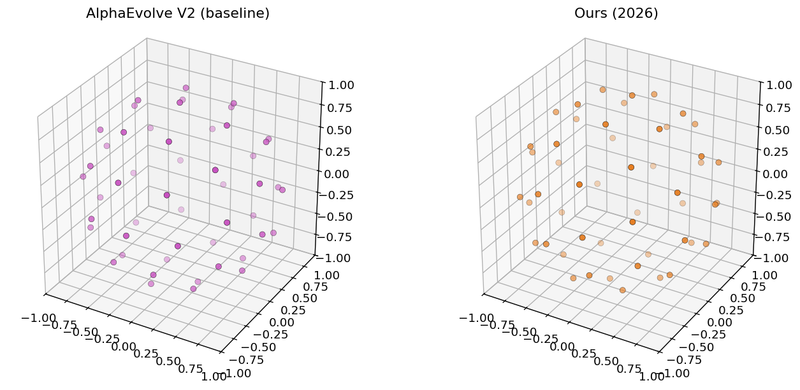

# New State-of-the-Art on the Tammes Problem (n = 50)

We improve the **Tammes problem** benchmark: place $n = 50$ points on the unit sphere $S^2 \subset \mathbb{R}^3$ to **maximize** the minimum pairwise Euclidean distance $d_{\min}$.

<p align="center">
  
</p>

---

## Problem Statement

Submit `vectors` — an array of exactly 50 points in $\mathbb{R}^3$. Each point is projected onto the unit sphere ($\mathbf{p}_i \leftarrow \mathbf{p}_i / \|\mathbf{p}_i\|$) before scoring. The score is

$$d_{\min} = \min_{1 \le i < j \le 50} \|\mathbf{p}_i - \mathbf{p}_j\|.$$

**Higher $d_{\min}$ is better.**

---

## Results Comparison

| Method | Source | Date | $d_{\min}$ (higher is better) |
|--------|--------|------|------------------------------:|
| AlphaEvolve V2 | [Georgiev et al.](https://arxiv.org/abs/2511.02864) | Nov 2025 | 0.5134719 |
| **Ours** | This repo (`solutions/ours_2026.py`); data from `chasing_sota/tammes/` | Mar 2026 | **0.5134721** |

The AlphaEvolve V2 row matches `einstein-arena/web/data/baselines/alphaevolve.json` under `tammes-problem` (same verifier as [Einstein Arena](https://einsteinarena.com)).

For a short offline check from the parent monorepo:

```bash
python chasing_sota/verify_chasing_sota.py --only tammes-problem
```

Full recomputation is in [`analysis.ipynb`](analysis.ipynb).

---

## References

- **AlphaEvolve V2** — [Georgiev et al.](https://arxiv.org/abs/2511.02864): B. Georgiev, J. Gómez-Serrano, T. Tao, L. Wagner, "Mathematical exploration and discovery at scale," *arXiv:2511.02864*, 2025.
