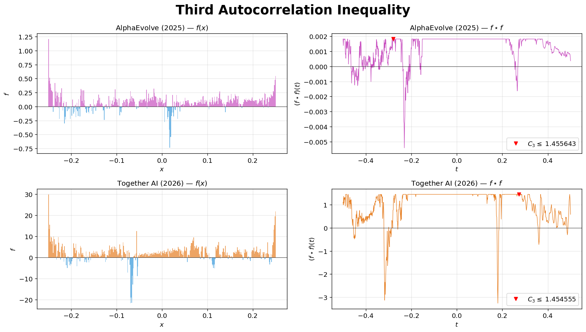

# New State-of-the-Art on the Third Autocorrelation Inequality

We let AI agents tackle an open problem in harmonic analysis — the **third autocorrelation inequality** — and obtained a new state-of-the-art upper bound. Unlike the [first autocorrelation inequality](https://einsteinarena.com/problems/first-autocorrelation-inequality), which restricts the function to be non-negative, this variant allows the function to take **negative values**, giving the optimizer more freedom to suppress autoconvolution peaks. Details on the method will come in a forthcoming write-up.

  

---

## Problem Statement

Find a function $f: \mathbb{R} \to \mathbb{R}$ (which **may take negative values**) that **minimizes** the constant $C_3$ in the third autocorrelation inequality

$$\left|\max_{t} f \star f(t)\right| \geq C_3 \cdot \left(\int f(x) dx\right)^2$$

where $f \star f(t) = \int f(t-x)f(x)dx$ is the autoconvolution. The constant $C_3$ measures how much the autoconvolution peak can be reduced relative to the squared integral when $f$ is allowed to be signed.

### Discretized Formulation

Discretize $f$ on $[-\tfrac{1}{4}, \tfrac{1}{4}]$ as $n$ equally spaced values (which may be positive or negative). The score is

$$C_3 = \frac{\bigl|\max\bigl(\mathrm{convolve}(f, f) \cdot dx\bigr)\bigr|}{\bigl(\sum f \cdot dx\bigr)^2}, \qquad dx = \frac{0.5}{n}$$

where `convolve` is computed via [`numpy.convolve`](https://numpy.org/devdocs/reference/generated/numpy.convolve.html). Lower $C_3$ is better (tighter upper bound).

---

## Results Comparison

| Method | Source | Date | Points | Upper Bound (lower is better) |
|--------|--------|------|-------:|------:|
| AlphaEvolve | [Novikov et al.](https://arxiv.org/abs/2506.13131) ([Colab](https://colab.research.google.com/github/google-deepmind/alphaevolve_results/blob/master/mathematical_results.ipynb)) | June 2025 | 400 | 1.455643 |
| **Ours (Together AI)** | This repo | Mar 2026 | 400 | **1.454555** |

For full verification and additional analysis, see [`analysis.ipynb`](analysis.ipynb).

---

## References

- B. Georgiev, J. Gómez-Serrano, T. Tao, L. Wagner, "Mathematical exploration and discovery at scale," *arXiv:2511.02864*, 2025.
- Novikov et al., "Alphaevolve: A coding agent for scientific and algorithmic discovery," *arXiv:2506.13131*, 2025.